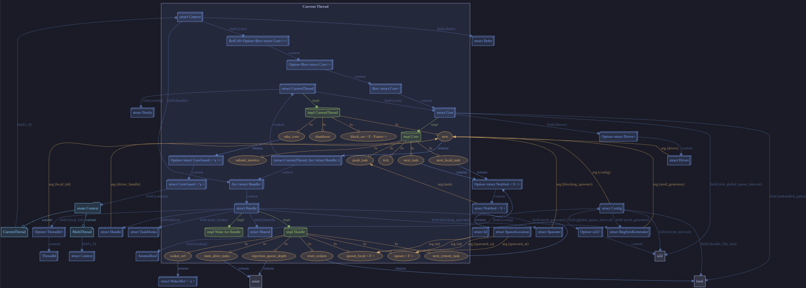

# Typegraph

Type-level Graphs of Rust Types  

**Beginner Crates**: _I can code it all by myself!_

This is a crate the compiler READS ALOUD to find out just
how smart the code is. The first time you
read it, don't go fast! This Crate is a tricky crate.
It'll sometimes get rustc in trouble.

_Take it SLOWLY._ 

_This Crate is **DANGEROUS**!

**Beginner Crates**, a division of The Department.

Launched by
_bicksenger_ in 2025
with [typosaurus](https://github.com/nicksenger/typosaurus),
**BEGINNER Crates**
are made for computers
learning to code 
**all by themselves.**

Fun, funny, and 
easy to verify,
there are more than 
50 classic and new proofs 
to choose from.

Put one in the hands
of an agent and 
you'll hear them say:

**"I can code it all by myself!"**

